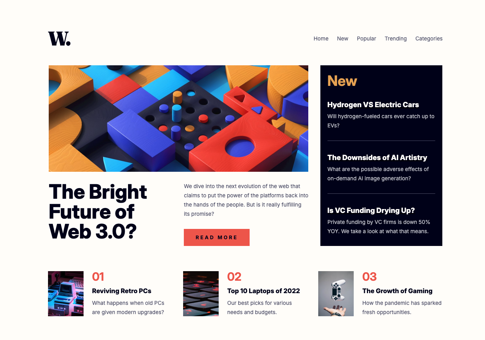

# Frontend Mentor - News homepage solution

This is a solution to the [News homepage challenge on Frontend Mentor](https://www.frontendmentor.io/challenges/news-homepage-H6SWTa1MFl). Frontend Mentor challenges help you improve your coding skills by building realistic projects.

## Table of contents

- [Overview](#overview)
  - [The challenge](#the-challenge)
  - [Screenshot](#screenshot)
  - [Links](#links)
- [My process](#my-process)
  - [Built with](#built-with)
  - [What I learned](#what-i-learned)
  - [Continued development](#continued-development)
- [Author](#author)

## Overview

### The challenge

Users should be able to:

- View the optimal layout for the interface depending on their device's screen size
- See hover and focus states for all interactive elements on the page

### Screenshot

### Links

- Solution URL: [Here](https://www.frontendmentor.io/solutions/responsive-homepage-sass-grid-flexbox-ts-K8VbEwvEAK)
- Live Site URL: [Here](https://nv-news-homepage.netlify.app/)

## My process

### Built with

- Semantic HTML5 markup
- SASS/SCSS
- TypeScript
- Flexbox
- CSS Grid
- Mobile-first workflow
- Accessibility best practices

### What I learned

This challenge was a good opportunity to continue to implement accessbility best practices as well as CSS Grid.

### Continued development

With each project I try to learn and implement something new to continue to build upon my frontend skills.

## Author

- Portfolio - [Nate Valline](https://natevalline.dev)
- Frontend Mentor - [@nvalline](https://www.frontendmentor.io/profile/nvalline)
- LinkedIn - [Nate Valline](https://www.linkedin.com/in/nvalline)
